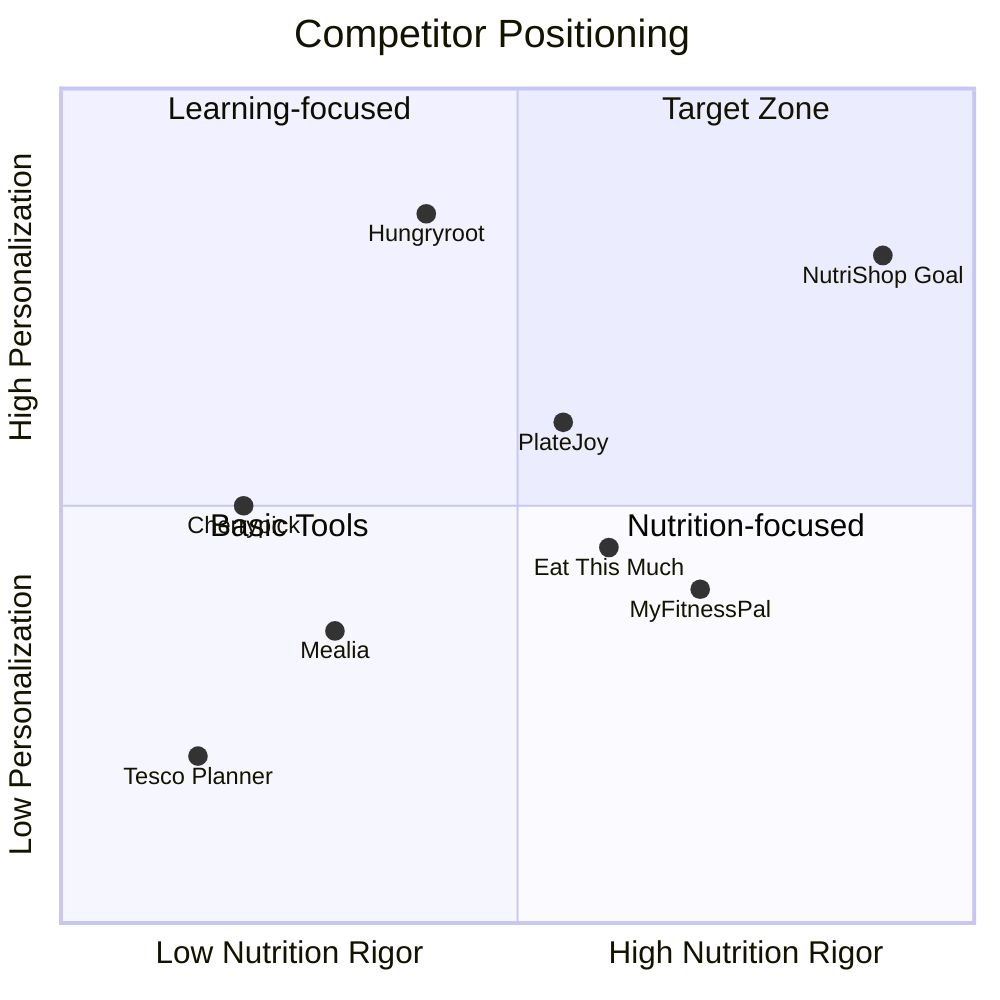

# Competitive Landscape Analysis

## Executive Summary

The nutrition-optimized grocery planning space is fragmented across several categories: meal planning apps, grocery delivery AI, nutrition trackers, and supermarket-native tools. While many competitors address individual aspects of the problem, **no single solution fully integrates mathematical nutrition optimization with real-time store availability, price optimization, and adaptive learning** — NutriShop's key differentiator.

---

## Competitor Matrix

| Competitor | Nutrition Optimization | Store Integration | Price Optimization | Learning/Personalization | Dietary Filters | UK Focus |
|------------|:---------------------:|:-----------------:|:-----------------:|:-----------------------:|:---------------:|:--------:|
| **NutriShop (Us)** | ✅ MILP Complete | 🔜 Planned | 🔜 Planned | 🔜 Planned | 🔜 Planned | ✅ |
| Eat This Much | ⚠️ Macro-focused | ⚠️ US only | ✅ Budget limits | ❌ | ✅ | ❌ |
| PlateJoy | ⚠️ Dietitian-designed | ⚠️ US only | ❌ | ⚠️ Basic | ✅ | ❌ |
| Mealime | ⚠️ Basic nutrition | ⚠️ US only | ❌ | ⚠️ Basic | ✅ | ❌ |
| Hungryroot | ⚠️ Goal-based | ✅ Own delivery | ❌ | ✅ AI SmartCart | ✅ | ❌ |
| Mealia | ⚠️ Basic | ✅ UK Supermarkets | ✅ Budget focus | ❌ | ⚠️ Basic | ✅ |
| Meal Matcher UK | ⚠️ Calories/macros | ✅ UK APIs | ✅ Real prices | ❌ | ⚠️ Basic | ✅ |
| Cherrypick | ❌ Recipe-focused | ✅ UK APIs | ❌ | ❌ | ✅ | ✅ |
| Tesco Meal Planner | ❌ None | ✅ Tesco only | ❌ | ❌ | ⚠️ Basic | ✅ |
| MyFitnessPal | ✅ Tracking only | ❌ | ❌ | ⚠️ Basic | ✅ | ❌ |

**Legend:** ✅ Strong | ⚠️ Partial | ❌ None | 🔜 Planned

---

## Tier 1: Direct Competitors (Closest to NutriShop's Vision)

### 🥇 Eat This Much
**The most direct competitor** — automatic meal planning with nutrition goals.

| Aspect | Details |
|--------|---------|
| **Website** | [eatthismuch.com](https://www.eatthismuch.com) |
| **Founded** | 2012 (San Francisco) |
| **Pricing** | Free tier (1-day) / Premium $9/month or $49/year |
| **Funding** | Bootstrapped |

**What They Do Well:**
- Automatic meal plan generation based on calorie/macro targets
- Supports keto, vegan, paleo, Mediterranean, etc.
- Grocery list generation with Instacart/AmazonFresh integration
- Budget limits per day/week
- Pantry tracking to use existing ingredients
- 5,000+ recipe database

**Gaps & Weaknesses:**
- ❌ **No micronutrient optimization** — focuses only on macros (protein, carbs, fats)
- ❌ **US-centric** — no UK supermarket integration
- ❌ **No true price optimization** — just budget caps, not cost minimization
- ❌ **No learning** — doesn't improve recommendations over time
- ❌ **Repetitive recipes** — users report monotonous suggestions
- ❌ **Outdated interface** — UX feels dated
- ❌ **Individual-focused** — challenging for families

> [!IMPORTANT]
> **Key Opportunity:** Eat This Much lacks micronutrient guarantees and UK store integration. NutriShop's MILP approach ensures *complete* nutrition, not just macro targets.

---

### 🥈 Hungryroot
**AI-driven personalized grocery + meal kit delivery.**

| Aspect | Details |
|--------|---------|
| **Website** | [hungryroot.com](https://www.hungryroot.com) |
| **Founded** | 2015 (New York) |
| **Pricing** | ~$65-70/week minimum |
| **Funding** | $55M+ raised (Series B) |

**What They Do Well:**
- **SmartCart AI** — 10 ML models for personalization
- Full grocery + meal kit delivery (not just planning)
- 10-15 minute meal prep with pre-cut ingredients
- Learns from user behavior (70% of items AI-selected)
- Accommodates allergies, dietary preferences
- Claims 90% of users achieve health goals

**Gaps & Weaknesses:**
- ❌ **US only** — no UK availability
- ❌ **Closed ecosystem** — can only buy their products, not shop locally
- ❌ **Expensive** — ~$10/serving, not budget-friendly
- ❌ **No nutritional guarantees** — goal-based but no RDA/UL optimization
- ❌ **Recipe simplicity** — some users find meals too basic
- ❌ **Subscription lock-in** — requires ongoing commitment

> [!NOTE]
> Hungryroot's SmartCart AI is a strong competitive benchmark for learning systems. However, their closed delivery model limits flexibility vs. local shopping.

---

### 🥉 PlateJoy
**Dietitian-designed, highly personalized meal planning.**

| Aspect | Details |
|--------|---------|
| **Website** | [platejoy.com](https://www.platejoy.com) |
| **Founded** | 2013 (San Francisco) |
| **Pricing** | ~$69/6 months or $99/year |
| **Funding** | $5M+ (Seed/Series A) |

**What They Do Well:**
- 50 data points for personalization (allergies, conditions, preferences)
- Supports diabetes, FODMAP, kidney-friendly, heart-healthy diets
- Dietitian oversight on meal plans
- Fitbit integration for calorie sync
- Grocery list with Instacart integration
- Household member support (different calorie needs)

**Gaps & Weaknesses:**
- ❌ **US only** — Instacart integration, no UK stores
- ❌ **No algorithm optimization** — dietitian-curated, not mathematically optimal
- ❌ **No price optimization** — no budget minimization
- ❌ **Limited learning** — doesn't adapt to user swaps over time

---

## Tier 2: UK-Specific Competitors

### 🇬🇧 Mealia
**Budget-focused UK meal planning with supermarket integration.**

| Aspect | Details |
|--------|---------|
| **Website** | [mealia.co.uk](https://mealia.co.uk) |
| **Focus** | Budget, health, sustainability |
| **Store Integration** | Tesco, Sainsbury's, Asda, Morrisons |

**What They Do Well:**
- Direct UK supermarket API integration
- Budget-optimized shopping baskets
- Sustainability focus
- Personalized meal plans

**Gaps & Weaknesses:**
- ❌ **No comprehensive nutrition optimization** — not RDA/UL-based
- ❌ **No learning system** — static recommendations
- ❌ **Limited dietary filters** — basic restrictions only

> [!TIP]
> Mealia proves UK supermarket API integration is achievable. Study their approach.

---

### 🇬🇧 Meal Matcher UK
**UK-first with real-time pricing.**

| Aspect | Details |
|--------|---------|
| **Website** | [mealmatcher.co.uk](https://mealmatcher.co.uk) |
| **Store Integration** | Tesco, Sainsbury's, M&S, Aldi |

**What They Do Well:**
- Real-time UK supermarket prices via direct API
- Calorie and macro tracking
- Weekly meal plan generation

**Gaps & Weaknesses:**
- ❌ **Macro-focused only** — no micronutrient optimization
- ❌ **No mathematical optimization** — curated, not computed
- ❌ **No learning** — static preferences

---

### 🇬🇧 Cherrypick (Closest Competitor)
**Plan. Shop. Cook. — UK's most similar app to NutriShop's vision.**

| Aspect | Details |
|--------|---------|
| **Website** | [cherrypick.co](https://cherrypick.co) |
| **Store Integration** | Tesco, Sainsbury's, Asda |
| **Pricing** | Free tier + Plus/Pro premium ($3-5/mo) |
| **Focus** | Health, sustainability, UPF reduction |

**What They Do Well:**
- Integrated meal planning with direct supermarket ordering
- Waste reduction via ML-powered cupboard detection
- UPF (ultra-processed food) tracking
- Plant diversity tracking
- Generous free tier
- Strong UK supermarket partnerships

**Gaps & Weaknesses — NutriShop's Opportunity:**

| Area | CherryPick | NutriShop Opportunity |
|------|------------|----------------------|
| **Price comparison** | ❌ Single store per order | ✅ **Cross-supermarket comparison** (which store is cheapest?) |
| **Nutrition optimization** | ⚠️ Recipe-focused, no RDA | ✅ **Complete MILP optimization** (all nutrients guaranteed) |
| **Family profiles** | ⚠️ Basic exclusions only | ✅ **Per-person profiles** with individual needs |
| **Discount supermarkets** | ❌ No Lidl or Aldi | ✅ Include budget supermarkets |
| **Pricing model** | Freemium with paywalled features | ✅ **100% free** (affiliate revenue) |
| **Budget focus** | Health-first positioning | ✅ **Budget-first + health** |
| **Picky eater tracking** | ❌ None | ✅ Per-child acceptance tracking |

> [!WARNING]
> CherryPick validates market demand but has significant traction. Differentiation must be clear:
> **"The budget-conscious family's alternative"** — cross-store price comparison + truly free + picky eater intelligence.

---

### 🇬🇧 Supermarket Native Tools

#### Tesco Real Food Meal Planner
- Free tool on [tesco.com](https://realfood.tesco.com)
- Recipe selection → auto-add to basket
- Diet filters (vegetarian, gluten-free, low-fat)
- **Weakness:** No nutrition optimization, Tesco-only, no personalization

#### Sainsbury's Meal Planner
- Free tool on [sainsburys.co.uk](https://sainsburys.co.uk)
- Weekly meal planning with "healthier" and "budget" themes
- Direct trolley integration
- **Weakness:** No nutrition optimization, Sainsbury's-only, no learning

---

## Tier 3: Adjacent Competitors

### Nutrition Trackers (No Shopping)

| App | Strength | Limitation |
|-----|----------|------------|
| **MyFitnessPal** | Massive food database, calorie/macro tracking, AI voice logging | No meal planning or shopping |
| **Cronometer** | Comprehensive micronutrient tracking | No meal planning or shopping |
| **Lose It!** | Weight loss focus, barcode scanning | No meal planning or shopping |

### AI Nutrition Startups

| Startup | Focus | Status |
|---------|-------|--------|
| **Aspect Health (Aida)** | AI dietitian + personal shopper from bloodwork | Early stage, US-focused |
| **Heali AI** | Medical condition nutrition (IBS, diabetes) | Specialized, not general |
| **Strongr Fastr** | Fitness-focused macro meal plans | Gym-bro audience, US |
| **Alymenta** | Multi-person household optimization | Limited traction |
| **Nuuro** | Health data + preference-based recipes | B2B focus |

### Meal Kit Delivery (Different Model)

| Service | Note |
|---------|------|
| **HelloFresh** | Meal kits, no shopping optimization, fixed recipes |
| **Gousto** | UK meal kits, some personalization, closed ecosystem |
| **Mindful Chef** | Health-focused UK meal kits, premium pricing |
| **Green Chef** | Organic/keto, US and UK, closed ecosystem |

---

## Competitive Advantages: NutriShop

| Advantage | vs. Eat This Much | vs. Hungryroot | vs. UK Apps |
|-----------|------------------|----------------|-------------|
| **Complete Nutrition** | They do macros only; we guarantee all RDAs | Goal-based, not guaranteed | None optimize |
| **Mathematical Optimization** | Budget caps only; we minimize cost | No cost optimization | Mealia is closest |
| **UK Store Integration** | US only | US only | Equal or better |
| **Discrete Portions** | Yes | N/A (delivery) | Partial |
| **Quick Swaps** | Limited | Hidden in UI | None |
| **Adaptive Learning** | None | Strong (SmartCart) | None |
| **Scientific Rigor** | Basic | Marketing claims | None |

---

## Market Opportunity

### Gap Analysis

### Key Insight
> The quadrant with **high nutrition rigor + high personalization** is relatively empty. This is NutriShop's target zone.

---

## Recommended Competitive Strategy

### Phase 1: Differentiate on Nutrition Science
- **Lead with "complete nutrition guarantee"** — no competitor offers this
- Emphasize RDA/UL constraints and scientific backing
- Publish methodology and evidence (transparency as trust-builder)

### Phase 2: Win on UK Integration
- Prioritize Tesco and Sainsbury's API integration (largest market share)
- Offer real pricing and availability — beat Eat This Much on locality
- Partner with UK nutrition influencers and dietitians

### Phase 3: Build Learning Advantage
- Study Hungryroot's SmartCart as benchmark
- Implement swap tracking and preference learning
- Create feedback loop that improves with usage

### Phase 4: Expand Features
- Recipe integration to compete with Cherrypick
- Mobile app to compete on convenience
- Family/household support to address gap vs. PlateJoy

---

## Monitoring Competitors

| Competitor | Monitor For |
|------------|------------|
| **Eat This Much** | UK expansion, micronutrient features |
| **Hungryroot** | UK launch, SmartCart improvements |
| **Mealia** | Nutrition feature additions |
| **Meal Matcher UK** | New supermarket partners |
| **Aspect Health** | UK launch, AI capabilities |

---

## Summary

NutriShop occupies a unique position in the market:

1. **No competitor guarantees complete nutrition** using mathematical optimization
2. **UK-focused apps lack optimization** — they just help you order
3. **US apps dominate in features** but have no UK presence
4. **Learning systems are rare** outside Hungryroot's closed ecosystem

The path forward is clear: lead with nutrition science, integrate deeply with UK stores, and build a learning system that makes the shopping experience progressively better.
