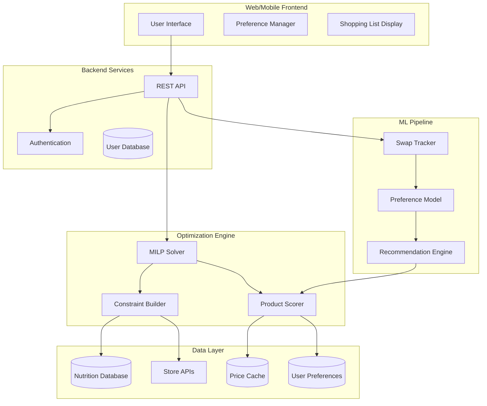

# NutriShop: Intelligent Nutrition-Optimized Grocery Planning

## Project Vision

**NutriShop** is a **free**, intelligent grocery shopping assistant that generates scientifically-optimized weekly shopping lists tailored to **family nutritional needs**, dietary preferences, UK supermarket availability, and **budget optimization with cross-store price comparison**.

> [!IMPORTANT]
> **Core Principle: Always free for users.**
> An app about saving money shouldn't cost money. Revenue comes from supermarket affiliate commissions, not user subscriptions.

### The 5 Pillars

| # | Pillar | Description |
|---|--------|-------------|
| 1 | 🥗 **Nutrition** | Complete RDA/UL optimization — no deficiencies, no toxicity |
| 2 | 💷 **Cost** | Cross-supermarket price comparison, budget optimization |
| 3 | ⏱️ **Time** | Quick meal planning, easy swaps, one-tap shopping lists |
| 4 | 🎯 **Personalization** | Per-family-member dietary profiles, picky eater tracking |
| 5 | 🛒 **Seamless Shopping** | Auto-generated lists → UK supermarket basket integration |

---

## Core Problem Statement

Most families struggle to:
1. Meet all their nutritional requirements (calories, macros, vitamins, minerals)
2. Balance nutrition with budget constraints
3. Accommodate multiple family members with different needs and preferences
4. Navigate conflicting dietary advice
5. Adapt meal plans to locally available products at the best prices

**NutriShop solves this** by using mathematical optimization to generate practical, purchasable shopping lists that guarantee nutritional completeness for the whole family while respecting budget and finding the best prices across UK supermarkets.

---

## Key Features & Requirements

### 1. Complete Nutritional Optimization
**Goal:** Generate shopping lists that satisfy ALL nutritional requirements with no deficiencies.

| Requirement | Description |
|-------------|-------------|
| Caloric Targets | Meet daily caloric needs based on TDEE calculations |
| Macronutrients | Protein, carbohydrates, fats within healthy AMDR ranges |
| Micronutrients | All vitamins (A, B-complex, C, D, E, K) at RDA/AI levels |
| Minerals | Iron, calcium, zinc, magnesium, potassium, etc. |
| Upper Limits | Respect Tolerable Upper Intake Levels (UL) to prevent toxicity |
| Fiber & Water | Adequate fiber intake and hydration considerations |

**Implementation:** Mixed-Integer Linear Programming (MILP) with constraints for minimum RDA and maximum UL values.

---

### 2. Local Store Integration
**Goal:** Only recommend products actually available at the user's local supermarket in purchasable quantities.

| Requirement | Description |
|-------------|-------------|
| Store Catalog Sync | Integration with UK supermarket APIs (Tesco, Sainsbury's, etc.) |
| Real-time Availability | Check product stock before recommending |
| Discrete Portions | Recommend whole units (1 pack, 2 cans) not fractional amounts |
| Package Sizes | Account for actual package sizes (500g bag, 6-pack) |
| Location-based | Filter to user's nearest store or delivery area |

**Implementation:** Store API integrations, portion size configurations, MILP integer constraints for discrete quantities.

---

### 3. Price-Aware Optimization (KEY DIFFERENTIATOR)
**Goal:** Minimize cost while meeting nutritional requirements, with cross-supermarket comparison.

| Requirement | Description |
|-------------|-------------|
| Budget Constraints | User can set weekly/monthly budget limits |
| Price Optimization | Objective function minimizes total cost |
| **Cross-Store Comparison** | Compare basket cost across Tesco, Asda, Sainsbury's, Lidl, Aldi |
| Value Analysis | Cost-per-nutrient efficiency rankings |
| Deal Integration | Factor in current offers and loyalty card prices |
| Price History | Track prices for smart timing suggestions |

**Implementation:** Cost coefficients in MILP objective function, budget as inequality constraint, price data from Trolley.co.uk or store APIs.

---

### 4. Goal-Based Recommendations
**Goal:** Tailor nutrition to specific health and fitness objectives with scientifically-backed guidance.

| Goal | Nutritional Adjustments |
|------|------------------------|
| **Weight Loss** | Caloric deficit (10-20%), higher protein (1.6-2.2g/kg), adequate fiber |
| **Muscle Building** | Caloric surplus (10-20%), high protein (1.6-2.2g/kg), creatine support |
| **Maintenance** | TDEE-matched calories, balanced macros within AMDR |
| **Athletic Performance** | Higher carbs, timing optimization, electrolyte focus |
| **General Health** | Balanced approach with emphasis on micronutrient diversity |

**Implementation:** Goal-specific constraint modifiers, evidence-based multipliers from sports nutrition research.

> [!NOTE]
> All recommendations must be based on peer-reviewed scientific literature. The system should cite sources and never make unsubstantiated health claims.

---

### 5. Quick Product Switches
**Goal:** Allow easy product substitutions where nutritional impact is minimal.

| Requirement | Description |
|-------------|-------------|
| Similarity Detection | Identify nutritionally-equivalent alternatives |
| One-Click Swaps | Easy UI to swap e.g., "Salmon → Haddock" |
| Impact Preview | Show how swap affects nutrition before confirming |
| Category Grouping | Group switchable items (white fish, leafy greens, etc.) |
| Preference Memory | Remember switches for future recommendations |

**Implementation:** Nutritional similarity scoring (cosine similarity on nutrient vectors), constraint re-validation on swap.

**Example Swap Groups:**
- **White Fish:** Cod, Haddock, Pollock, Sea Bass
- **Leafy Greens:** Spinach, Kale, Swiss Chard, Collards
- **Legumes:** Chickpeas, Lentils, Black Beans, Kidney Beans
- **Whole Grains:** Brown Rice, Quinoa, Bulgur, Farro

---

### 6. Adaptive Learning System
**Goal:** Learn user preferences to reduce manual adjustments over time.

| Requirement | Description |
|-------------|-------------|
| Swap Tracking | Record every product swap the user makes |
| Preference Modeling | Build user taste profile from choices |
| Diversity Injection | Ensure variety while respecting preferences |
| Feedback Loop | Explicit ratings and implicit behavior signals |
| Cold Start | Sensible defaults for new users with preference questionnaire |

**Implementation:** Collaborative filtering, preference embeddings, reinforcement learning for long-term satisfaction.

**Learning Signals:**
- Products swapped OUT → Negative preference signal
- Products swapped IN → Positive preference signal  
- Products kept → Neutral/positive signal
- Repeat purchases → Strong positive signal

---

### 7. Dietary Requirement Filters
**Goal:** Accommodate all major dietary restrictions and preferences.

| Filter | Foods Excluded |
|--------|---------------|
| **Vegetarian** | Meat, poultry, fish (allows dairy, eggs) |
| **Vegan** | All animal products |
| **Pescatarian** | Meat, poultry (allows fish) |
| **Kosher** | Non-kosher meats, shellfish, mixing meat/dairy |
| **Halal** | Pork, non-halal meats, alcohol |
| **Gluten-Free** | Wheat, barley, rye, contaminated oats |
| **Lactose-Free** | Milk, cheese, cream (allows lactose-free alternatives) |
| **Nut-Free** | All tree nuts and peanuts |
| **Low-Sodium** | High-sodium processed foods |

**Implementation:** Filter constraints in MILP, food database tagging, certification verification.

---

## System Architecture

---

## Current Implementation Status

### ✅ Completed
- **Nutrition Calculator:** TDEE/BMR calculations with activity multipliers
- **MILP Optimizer:** Core optimization with macro/micronutrient constraints
- **Nutrition Database:** Comprehensive food nutrient data (FooDB + CoFID merged)
- **Nutrient Limits:** Scientific RDA/UL values for constraint bounds
- **Discrete Portions:** Integer quantity constraints for practical shopping
- **Basic Web Interface:** Flask-based frontend for calculator

### 🚧 In Progress
- Price integration with UK supermarkets
- Portion size refinement
- Goal-based adjustment implementation

### 📋 Planned
- User authentication and profiles
- Store API integrations (Tesco, Sainsbury's)
- Product swap system with similarity scoring
- Preference learning ML pipeline
- Dietary filter implementation
- Mobile application (React Native or Flutter)
- Recipe integration and meal planning

---

## Technical Stack

| Component | Technology |
|-----------|------------|
| **Backend** | Python, Flask |
| **Optimization** | PuLP (MILP solver) |
| **Database** | CSV files (nutrition), SQLite/PostgreSQL (users) |
| **Frontend** | HTML/CSS/JavaScript, planned React/Vue migration |
| **ML Pipeline** | scikit-learn, PyTorch (planned) |
| **API Integrations** | Requests, aiohttp for async store APIs |
| **Mobile** | React Native or Flutter (planned) |

---

## Data Sources

| Source | Purpose |
|--------|---------|
| **FooDB** | Comprehensive food composition database |
| **CoFID** | UK-specific nutritional values |
| **USDA FoodData Central** | Backup/validation nutrient data |
| **Store APIs** | Real-time product availability and pricing |
| **Scientific Literature** | RDA, UL, AMDR values and goal-specific guidance |

---

## Key Files Reference

| File | Purpose |
|------|---------|
| `src/optimizer/optimizer.py` | MILP optimization engine |
| `src/calculator/` | Nutritional calculations (BMR, TDEE, macros) |
| `src/web_app/main.py` | Flask web application |
| `data/config/nutrient_limits.json` | RDA and UL constraint values |
| `data/config/nutrition_data.json` | Nutrient reference data |
| `data/config/portion_sizes.json` | Discrete portion configurations |
| `data/processed/` | Processed nutrition databases (CSV) |

---

## Success Metrics

1. **Nutritional Completeness:** 100% of RDA met for all essential nutrients
2. **User Satisfaction:** <3 swaps per shopping list after learning period
3. **Budget Adherence:** Within 5% of user's stated budget
4. **Practical Feasibility:** All items available in integer quantities at local store
5. **Health Outcomes:** User-reported energy levels, wellbeing (long-term)

---

## Development Principles

1. **Evidence-Based:** All nutritional guidance must cite scientific sources
2. **Transparency:** Show users WHY items are recommended
3. **Flexibility:** Never force foods users dislike; always offer alternatives
4. **Privacy:** Protect dietary and health data with encryption and minimal collection
5. **Accessibility:** Support users with various dietary restrictions without judgment

---

## Monetization Strategy

### Revenue Model: 100% Free for Users

| Stream | User Cost | Revenue Source | When |
|--------|-----------|----------------|------|
| Core app | Free | — | Day 1 |
| Affiliate commissions | Free | 1-4% from supermarket orders | Phase 2 |
| Sponsored healthy brands | Free | Ethical brand placements | Phase 3 |
| B2B licensing | N/A | API to meal kit companies | Future |

### Ethical Guardrails
- Always show true price comparison (never favor partners for commission)
- Be transparent: "We may earn a small commission"
- Never let affiliate revenue influence nutritional recommendations
- No banner ads or intrusive monetization

---

## Future Vision (Priority Order)

1. **Family Profiles** — Multi-person household optimization with per-member dietary needs
2. **Cross-Store Price Comparison** — Show cheapest store for each shopping list
3. **Supermarket Deep Linking** — One-tap add to Tesco/Asda/Sainsbury's basket
4. **Recipe Integration** — Suggest recipes using the optimized shopping list
5. **Picky Eater Intelligence** — Track per-child food acceptance, gradual introduction
6. **Meal Prep Plans** — Weekly cooking schedules with nutrition tracking
7. **Health Integration** — Connect with fitness trackers and health apps
8. **Sustainability Score** — Carbon footprint and environmental impact metrics

---

> [!TIP]
> When working on any feature, always ask: "Does this help the user achieve complete nutrition while respecting their preferences, budget, and local availability?"
